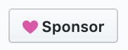
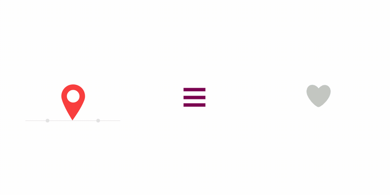

# 测试
## 测试1  从Repo上copy一份测试lottie动画, 包含点赞和 收藏动画
```xml
   <com.airbnb.lottie.LottieAnimationView
        android:id="@+id/wishListIcon"doOd
        android:layout_width="96dp"
        android:layout_height="96dp"
        android:scaleType="centerCrop"
        app:layout_constraintLeft_toLeftOf="parent"
        app:layout_constraintTop_toTopOf="parent"
        //指定资源地址
        app:lottie_rawRes="@raw/heart" />
```
```java
        //speed<0 逆序播放，比如取消点赞
       wishListIcon.speed = if (activated) 1f else -2f
       //复位进度
        wishListIcon.progress = 0f
        //开始播放
        wishListIcon.playAnimation()
```

> LottieAnimationView 如果使用网络URL，当无网络的时候会崩溃，暂时没去跟踪

# Lottie for Android, [iOS](https://github.com/airbnb/lottie-ios), [React Native](https://github.com/airbnb/lottie-react-native), [Web](https://github.com/airbnb/lottie-web), and [Windows](https://aka.ms/lottie)
[](https://travis-ci.org/airbnb/lottie-android)


<a href='https://play.google.com/store/apps/details?id=com.airbnb.lottie'></a>

Lottie is a mobile library for Android and iOS that parses [Adobe After Effects](http://www.adobe.com/products/aftereffects.html) animations exported as json with [Bodymovin](https://github.com/bodymovin/bodymovin) and renders them natively on mobile!

For the first time, designers can create **and ship** beautiful animations without an engineer painstakingly recreating it by hand. They say a picture is worth 1,000 words so here are 13,000:

# Sponsors
Lottie is maintained and improved on nights and weekends. If you use Lottie in your app, please consider sponsoring it to help ensure that we can continue to improve the project we love.
Click the sponsor button above to learn more



## Lead Sponsors


## View documentation, FAQ, help, examples, and more at [airbnb.io/lottie](http://airbnb.io/lottie/)





## Download

Gradle is the only supported build configuration, so just add the dependency to your project `build.gradle` file:

```groovy
dependencies {
  implementation 'com.airbnb.android:lottie:$lottieVersion'
}
```
The latest Lottie version is:


Lottie 2.8.0 and above only supports projects that have been migrated to [androidx](https://developer.android.com/jetpack/androidx/). For more information, read Google's [migration guide](https://developer.android.com/jetpack/androidx/migrate).
